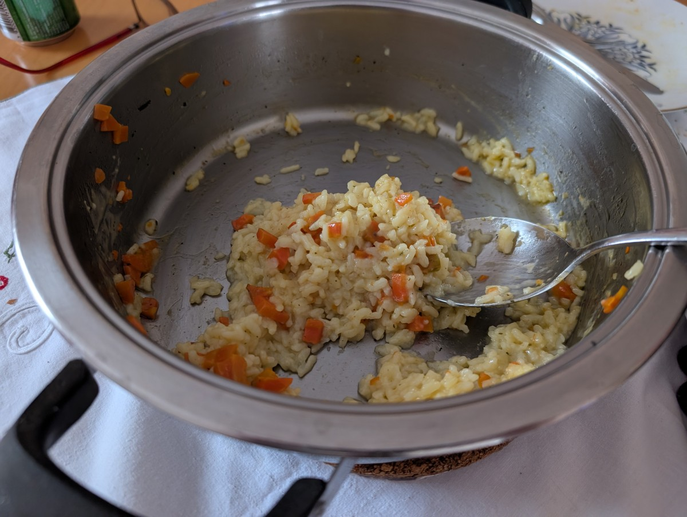

# Mum's Risotto

## Ingredients

For 2 people:

- a bit of olive oil to cover the pan
- 1/4 of a small onion, finely chopped
- 2 medium carrots, finely chopped cubes
- Optional: Peas (frozen to fry, or canned to add at the end)
- 150 ml of rice (for risotto; washed with water, soak for a few minutes then
  drain)
- 1 tablespoon of Vegeta
- Dry white wine (about 1/3 volume of rice)
- 1 whole clove of garlic
- Water (2.5 times the volume of rice)
- 1 teaspoon butter
- some chopped parsley for garnish

## Instructions

1. On medium temperatur slowly fry a very small amount of finely chopped onion
   in olive oil until glazed.
2. Add finely chopped carrots and fry a bit more.
3. (Optional) If using frozen peas, add them and fry. If using canned peas, add
   them at the end.
4. Add washed and drained rice, fry/stir until glazed.
5. Add Vegeta.
6. Add the whole clove of garlic.
7. Add dry white wine (about 1/3 volume of rice).
8. Stir wine until it evaporates.
9. Add water (twice the volume of rice), cover, and simmer slowly. Add more
   water as needed. You can taste whether there's enough vegeta.
10. At the end, when cooked, add 1 teaspoon of butter.
11. Add parsley for garnish.
