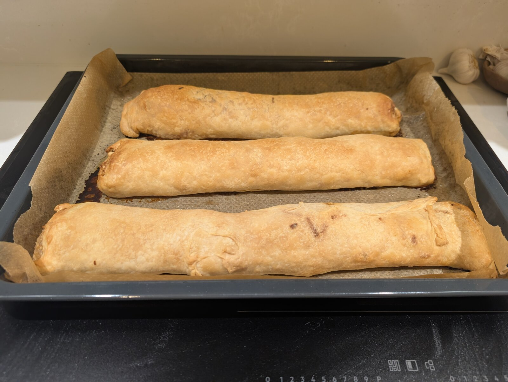
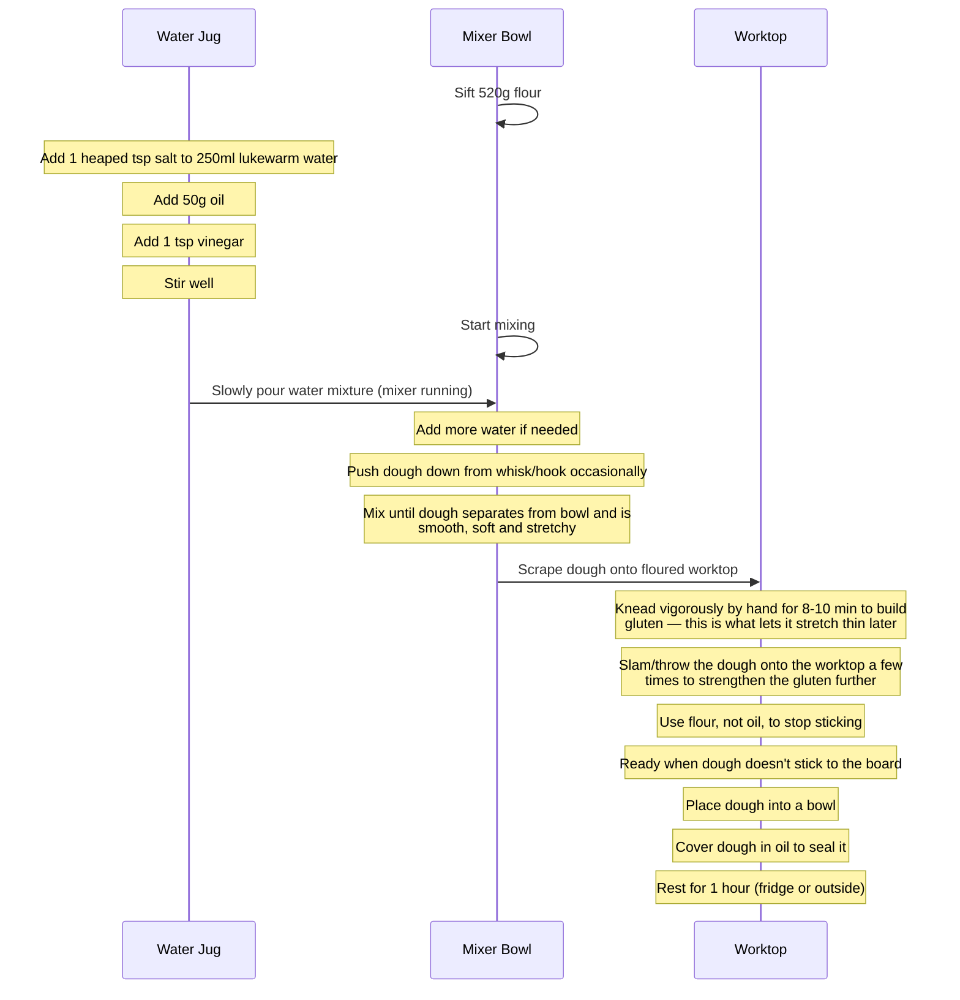
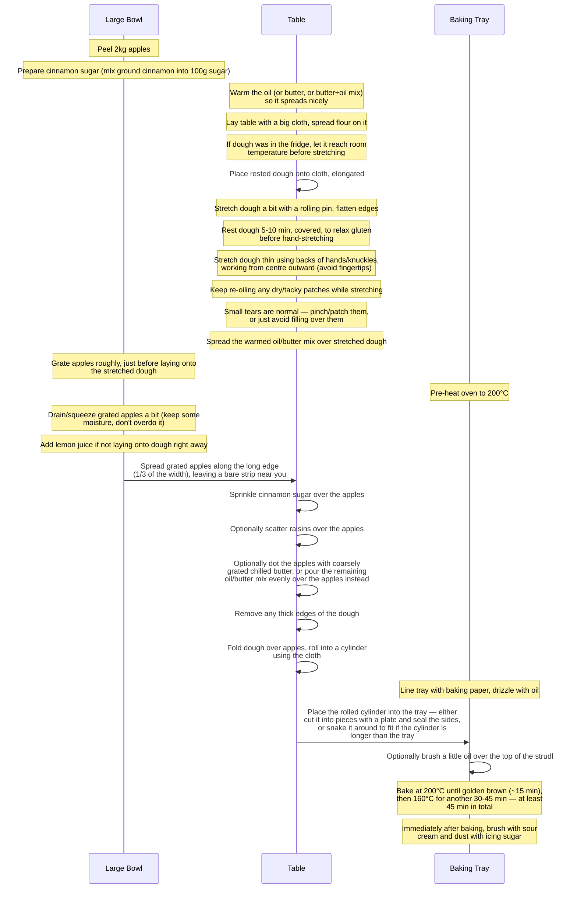
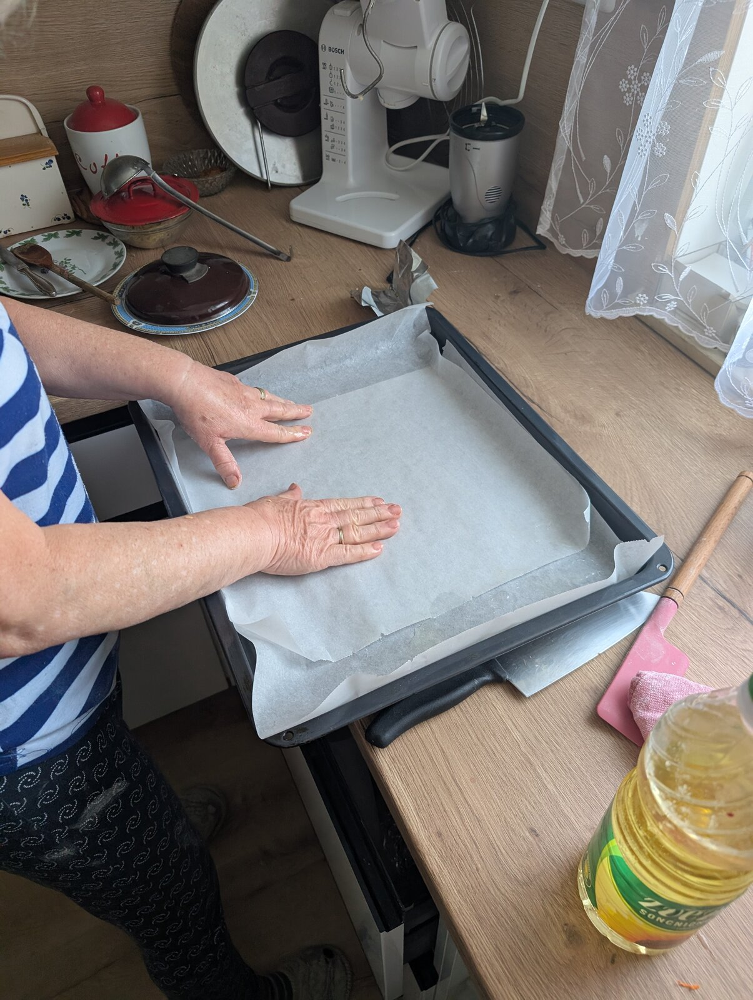
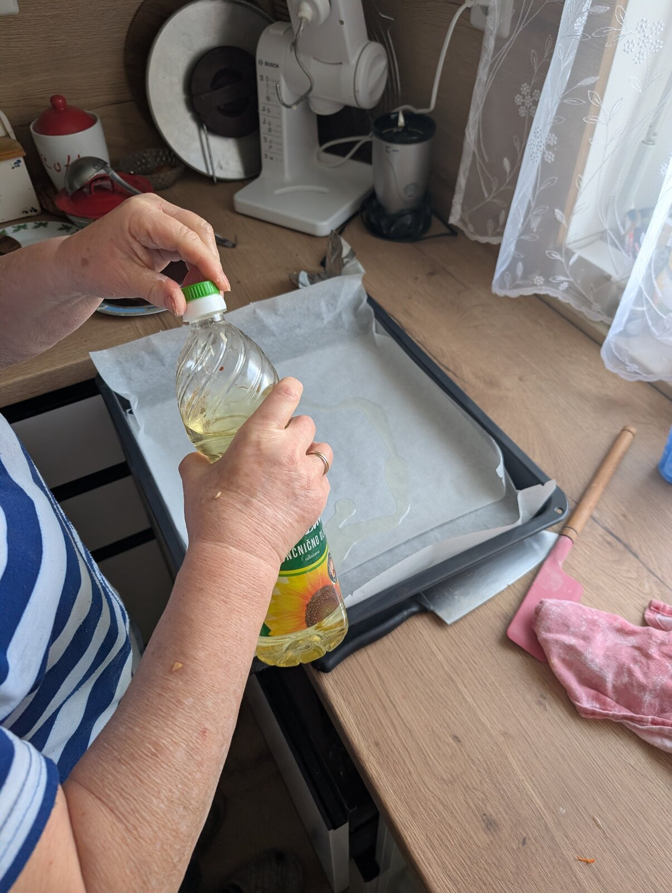

# Štrudl



Note: this recipe can be doubled (e.g. 1kg flour, 4kg apples, etc.) to make a
bigger strudl.

Reference video: [How to make štrudl](https://youtube.com/watch?v=EtdhufN-Ps4)

## Ingredients

### Pulled dough

- 520g plain flour
- 250ml lukewarm water
- 1 tsp salt
- 50g oil
- 1 tbsp vinegar

### Apple filling

- 2kg sour apples
- Freshly squeezed juice of 2 lemons (to prevent oxidation - not needed if the
  apples are grated just before laying them onto the dough)
- Ground cinnamon (to taste)
- 100g granulated sugar for sprinkling (add more if you prefer a sweeter
  strudel — e.g. 150g worked well with Braeburn apples)
- Butter, chilled (optional, to taste) — coarsely grated butter is the best
  option, but melted butter (mixed into the oil) or small pieces work too
- 100g raisins (optional, can be left out)

### Finishing

- Sour cream, for brushing on top
- Icing (dusting) sugar, for dusting on top

## At a glance

```d2 alt="Dough ingredients at a glance"
direction: down

vars: {
  d2-config: {
    sketch: true
  }
}

classes: {
  arrow: {
    style.stroke: "#c2724b"
  }
}

Salt: {
  label: ""
  shape: image
  icon: ../icons/salt-1tsp-spoon.webp
  width: 150
  height: 150
}
Oil: {
  label: ""
  shape: image
  icon: ../icons/oil-50g-bottle.webp
  width: 150
  height: 225
}
Vinegar: {
  label: ""
  shape: image
  icon: ../icons/vinegar-1tbsp-spoon.webp
  width: 160
  height: 107
}
Flour: {
  label: ""
  shape: image
  icon: ../icons/flour-520g-bag.webp
  width: 150
  height: 150
}

Jug: {
  label: ""
  shape: image
  icon: ../icons/water-250ml-stirred-in-beaker.webp
  width: 150
  height: 225
}
Sifter: {
  label: ""
  shape: image
  icon: ../icons/sieve-sifting-flour.webp
  width: 150
  height: 150
}
Mixer: {
  label: ""
  shape: image
  icon: ../icons/red-stand-mixer-with-bowl.webp
  width: 160
  height: 160
}
Worktop: {
  label: ""
  shape: image
  icon: ../icons/kneading-dough-on-worktop.webp
  width: 220
  height: 147
}
Resting: {
  label: ""
  shape: image
  icon: ../icons/oiled-dough-in-bowl.webp
  width: 150
  height: 225
}

Salt -> Jug: {class: arrow}
Oil -> Jug: {class: arrow}
Vinegar -> Jug: {class: arrow}

Flour -> Sifter: {class: arrow}
Sifter -> Mixer: {class: arrow}
Jug -> Mixer: {class: arrow}

Mixer -> Worktop: {class: arrow}
Worktop -> Resting: {class: arrow}
```

### Prep

```d2 alt="Table and apple prep at a glance"
direction: down

vars: {
  d2-config: {
    sketch: true
  }
}

Table: {
  label: ""
  shape: image
  icon: ../icons/table-with-cloth.webp
  width: 220
  height: 147
}
Peeling: {
  label: ""
  shape: image
  icon: ../icons/apples-2kg-peeling.webp
  width: 150
  height: 225
}
```

```d2 alt="Cinnamon sugar and butter prep at a glance"
direction: down

vars: {
  d2-config: {
    sketch: true
  }
}

CinnamonSugar: {
  label: ""
  shape: image
  icon: ../icons/cinnamon-1-5tsp-sugar-150g-mix.webp
  width: 150
  height: 225
}
Butter: {
  label: ""
  shape: image
  icon: ../icons/butter-50g-oil-100g-warming.webp
  width: 150
  height: 225
}
```

### Filling, Rolling & Baking

```d2 alt="Filling, rolling and baking at a glance"
direction: down

vars: {
  d2-config: {
    sketch: true
  }
}

classes: {
  arrow: {
    style.stroke: "#c2724b"
  }
  label: {
    style.font-color: "#8a6b52"
  }
}

Rolling: {
  label: ""
  shape: image
  icon: ../icons/rolling-dough-with-pin.webp
  width: 220
  height: 147
}
Smearing: Spread oil/butter on dough {
  class: label
  shape: image
  icon: ../icons/smearing-dough-with-oil.webp
  width: 220
  height: 147
}
Dough: Stretch with oiled palms {
  class: label
  shape: image
  icon: ../icons/stretching-dough.webp
  width: 220
  height: 147
}
ApplesOnDough: "Apples, cinnamon sugar & oil/butter on dough" {
  class: label
  shape: image
  icon: ../icons/apples-on-dough.webp
  width: 220
  height: 147
}
Grating: {
  label: ""
  shape: image
  icon: ../icons/apples-grating.webp
  width: 150
  height: 225
}
Cylinder: Roll the strudel with the help of the cloth {
  class: label
  shape: image
  icon: ../icons/rolled-strudel.webp
  width: 220
  height: 147
}
Tray: Tray & Oven {
  class: label
  shape: image
  icon: ../icons/placeholder-unknown.webp
  width: 100
  height: 150
}

Rolling -> Smearing: {class: arrow}
Smearing -> Dough: {class: arrow}

Grating -> ApplesOnDough: {class: arrow}
Dough -> ApplesOnDough: {class: arrow}

ApplesOnDough -> Cylinder: {class: arrow}
Cylinder -> Tray: {class: arrow}
```

## Diagrams

### Making the dough



### Filling, Rolling & Baking



## Detailed instructions

There are 3 stations for preparation:

1. Mixer bowl (for the dough)

2. Large bowl (for the apples)

3. Water jug

Sequence at the mixer bowl station:

- Sift the 520g of flour into the mixer bowl

- Start mixing just before adding the water mix

- You might have to add more water

- Push the dough down from the mixer's whisk/hook occasionally while it mixes

- Mix for a while until the dough separates from the bowl

- It might be easier to knead from here on, but you can mix to the end until the
  dough is smooth and it must be soft and stretchy

- Scrape the dough out of the mixer bowl onto a lightly floured worktop

  <video src="photos/dough-onto-worktop.mp4" poster="photos/dough-onto-worktop-poster.jpg" controls muted loop playsinline style="max-width: 100%;"></video>

- Even with a good mixer, it's worth kneading by hand at the end — aim for
  8-10 minutes of vigorous kneading, not just a light knead. This is what
  builds up the gluten network that lets the dough stretch thin later
  without tearing.

- If you knead, use flour (not oil) on the worktop to stop the dough sticking; a
  silicone spatula helps to unstick the dough if it clings to the worktop

- Throwing/slapping the dough onto the worktop a few times is another way to
  knead it, and further strengthens the gluten

- if you knead, you can tell it's getting close if the dough doesn't stick to
  the board (you might have to add a bit of flour to achieve that)

- after that place the dough into a bowl

- cover the dough in oil (to seal it)

- place the dough into the fridge to rest for an hour (you can leave the dough
  outside as well)

Sequence at the water jug:

- Add a heaped teaspoon of salt into the 250 ml of lukewarm water

- Add 50g of oil to the water as well

- Add a teaspoon of vinegar to the water as well

- Stir the water well

- Slowly pour the water mixture into the mixer bowl while the mixer is running

- The dough must be very stretchy

Sequence at the large bowl:

- Peel the 2kg of apples

- Grate the apples (roughly; through big holes on the grater)

- Drain/squeeze the grated apples a bit to get rid of excess juice, otherwise
  the filling ends up too watery. Don't overdo it though — squeeze out just
  the excess liquid, not all of it, so the filling stays moist.

- Add the lemon juice to the apples to prevent oxidation

Sequence at the table:

- Lay the table with a big cloth, fully unfolded, hanging evenly over both
  sides of the table — this gives you slack to pull the cloth (and the
  dough with it) back to the centre if the dough migrates to one side while
  stretching

- Spread a light dusting of flour on the cloth — just enough to stop
  sticking; too much dries out the dough's surface and makes it crack
  when stretched

- If the dough was rested in the fridge, let it come back to room
  temperature before stretching — cold dough is stiffer and much more
  prone to tearing

- Place the rested dough onto the cloth, elongated

  <video src="photos/dough-on-table.mp4" poster="photos/dough-on-table-poster.jpg" controls muted loop playsinline style="max-width: 100%;"></video>

- With the help of a rolling pin stretch the dough a bit and flatten the edges

- Make sure the dough doesn't stick to the cloth

- Spread the oil left-over from the dough onto the stretched dough

- Let the dough rest here for 5-10 minutes, covered (e.g. with a bowl), to
  let the gluten relax again before the final stretch — skipping this makes
  the dough spring back and tear more easily

- Stretch the dough thin using the backs of your hands/knuckles rather than
  your fingertips (fingertips/nails tend to puncture it). Work from the
  centre outward, rotating around the dough a little at a time, until it's
  thin enough to see your hand through.

- Keep re-oiling the surface as you stretch, especially any spot that looks
  like it's starting to dry out or go tacky — a dry patch turns brittle and
  is where tears tend to start

- Small tears/holes are normal, not a failure — don't panic or restart. Just
  pinch the edges of a tear back together (patch with a scrap of dough cut
  from the thicker rim if needed), or simply leave small holes and avoid
  laying filling directly over them

  // TODO: get a video of how mum stretches the dough

- Spread melted butter mixed with oil over the stretched dough, before adding
  the apples. Using just oil, or just melted butter, also works — it's up to
  the baker.

  <video src="photos/butter-on-dough.mp4" poster="photos/butter-on-dough-poster.jpg" controls muted loop playsinline style="max-width: 100%;"></video>

- Spread the apples all along the long edge, but keep a stretch of the dough
  near you so you can fold it over the apples later. The strip of apples should
  be 1/3 of the width along the other edge.

- Sprinkle ground cinnamon over the apples

  <video src="photos/cinnamon-on-apples.mp4" poster="photos/cinnamon-on-apples-poster.jpg" controls muted loop playsinline style="max-width: 100%;"></video>

- Sprinkle the sugar over the apples, a bit more generously where the apple
  layer is thicker (you can also mix the cinnamon into the sugar beforehand,
  instead of sprinkling it separately)

  <video src="photos/sugar-on-apples.mp4" poster="photos/sugar-on-apples-poster.jpg" controls muted loop playsinline style="max-width: 100%;"></video>

- Optionally scatter raisins over the apples

- Optionally dot the apples with butter. The best way is to coarsely grate
  chilled, hard butter over the apples (like grating Parmesan, but using the
  large/coarse holes of the grater instead of fine ones). Melted butter mixed
  into the oil, or small pieces of butter, also work. Alternatively, pour the
  remaining oil/butter mix evenly over the apples instead.

  <video src="photos/butter-on-apples.mp4" poster="photos/butter-on-apples-poster.jpg" controls muted loop playsinline style="max-width: 100%;"></video>

- Remove any thick edges of the dough hanging around

- Fold the dough over the apples and use the cloth along the long edge to keep
  turning the strudl over itself into a cylindrical roll.

  // TODO: get a video of mum folding the strudl with the table cloth

Sequence at the baking tray:

- Pre-heat the oven to 200°C (start just after grating the apples, so it's
  ready in time for baking)

- Line the baking tray with baking paper

  

- Drizzle a little oil onto the baking paper

  

- Optionally, brush a little oil over the top of the strudl before baking —
  not strictly necessary, but it helps the crust brown nicer

- Place the tray in the middle of the oven, or just below middle

- Bake in a fan electric oven, starting at 200°C until the crust turns golden
  brown (~15 minutes), then lower to 160°C and continue baking for another
  30 to 45 minutes. The strudl should be in the oven for at least 45 minutes
  in total.

- Immediately after taking the strudl out of the oven, brush sour cream over
  the top, then dust it with icing sugar
