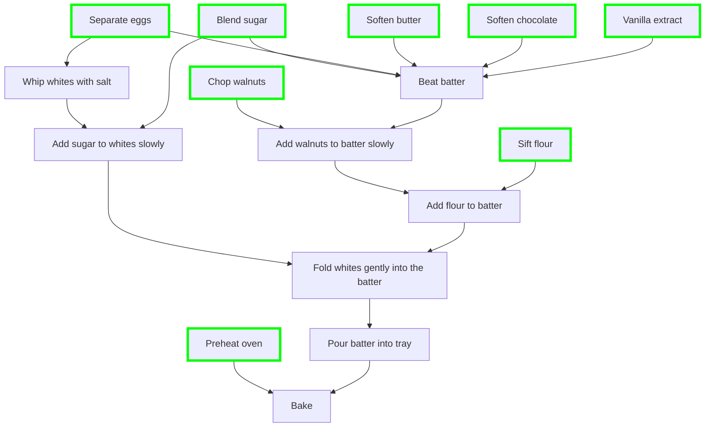

# Zamorček

## Ingredients

- 150g of chopped walnuts (amount to taste)
- 250 to 280g of sugar
- 250g soft butter
- 200g sieved flour
- 150g of chocolate
- 2 tsp baking powder
- 8 eggs (yolks and whites separated), use 9 if eggs are slightly smaller.
- 1.5 tsp vanilla extract
- Pinch of salt (into egg whites)

## Instructions

1. Preheat fan oven to 165°C.
2. Chop walnuts.
3. Blend all the sugar to get sugar powder.
4. Soften 250g butter at room temperature (slice into thinner slices and put in
   30°C oven briefly if needed).
5. Soften chocolate in the oven at 30°C (don't leave in there for too long, it's
   not great if the chocolate is too warm).
6. Separate egg yolks from whites (egg yolks go into the mixer's bowl and whites
   into their own big bowl for whisking later). Use a mug on which to separate
   yolks from whites. This way you won't have problems if yolks spill. It's
   important not to have any yolk in the whites.
7. Sift 200g flour with 2 tsp baking powder.
8. In mixer at top speed: beat chocolate, butter, egg yolks, 2/3 to 3/4 of the
   sugar, and vanilla extract until creamy.
9. Slow down the mixed to minimum and slowly add flour mixture and chopped
   walnuts until well mixed.
10. Whip egg whites with pinch of salt.
11. When the egg whites start to stiffen add 1/4 to 1/3 of the sugar two
    spoonfuls at a time.
12. You know you're done when the egg whites are stiff (test: a bit stands on
    its own).
13. Gently fold egg whites into batter (to prevent compaction of the egg
    whites).
14. Line tray with baking paper (make sure the walls are lined with baking paper
    as well), pour batter, spread evenly.
15. Bake 35 min at 165°C.

## Work organisation

**Long ahead**:

- take butter out of the fridge.

**Ahead of everything**: Chop walnuts.

**Just before work**:

- 1 big whisking bowl (for egg whites)
- 1 mixer bowl (for egg yolks)
- 1 small bowl (for walnuts)
- 1 tray with baking paper nicely lined even on walls (cut into corners
  diagonally to bend along walls nicely)

## Flowchart

## Original recipe

